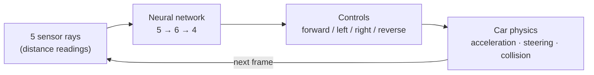

# 🚗 Self-Driving Car — A Neural Network Built From Scratch

[](https://self-driving-carv3js.netlify.app/)
[](LICENSE)


A browser-based simulation where cars teach themselves to drive — staying in lane, dodging traffic — using a neural network written entirely from scratch in plain JavaScript. No TensorFlow.js, no Brain.js, no ML library of any kind. Every weight, bias, and mutation is hand-rolled arithmetic you can read top to bottom.

**🔗 Live demo:** https://self-driving-carv3js.netlify.app/

---

## Why This Project Exists

Most people meet neural networks through a library — you call `.fit()`, a loss number goes down, and the "thinking" happens somewhere you can't see. This project exists to do the opposite: build a neural network with nothing but arrays and `Math.random()`, and then put it on screen next to what it's controlling, so the "thinking" is the whole show.

That's the point of the split-screen layout: on the left, cars drive; on the right, the **exact same network** that's driving the current best one is drawn live — every node, every weighted connection, every bias — updating in real time as the car makes decisions. Watching a connection change color as a sensor ray gets closer to a wall is a far more direct way to understand a feed-forward pass than reading about one.

Two constraints shaped everything here:

- **No ML libraries.** `network.js` *is* the entire neural network implementation — layers, weights, biases, feed-forward math, and the mutation rule that stands in for training.
- **No hidden magic.** Sensors, physics, collisions, and rendering are all plain JavaScript and the HTML5 Canvas API, so the whole pipeline from "ray hits a wall" to "car steers away from it" is visible in the source, not buried in a dependency.

## How It Works

Each car runs the same loop, every animation frame:



1. **Sense** — Five rays fan out 90° in front of the car (`sensor.js`) and report how close the nearest road edge or traffic car is along each one.
2. **Think** — Those five readings feed into a hand-written neural network (`network.js`): a fully-connected `5 → 6 → 4` feed-forward network. Each output neuron fires `1` or `0` based on a simple threshold — no sigmoid, no ReLU, just "is the weighted sum bigger than the bias."
3. **Act** — The four outputs map directly to `forward` / `left` / `right` / `reverse` in `controls.js`, which drive the car's acceleration and steering in `car.js`.
4. **Repeat**, every frame, until the car crashes.

There's no backpropagation and no training data anywhere in this codebase. Instead, it learns through a small, hand-rolled **genetic algorithm**:

- On the very first load (no saved brain yet), 100 cars spawn, each with completely random weights and biases.
- Every frame, whichever car has driven the farthest becomes the current `bestCar` — its brain is what the right-hand canvas draws.
- Clicking **💾** saves that best brain to `localStorage`.
- From then on, every reload spawns a new batch of 100: one exact, untouched copy of the saved brain (so progress never regresses) plus 99 slightly mutated copies (`NeuralNetwork.mutate`, which nudges every weight and bias a little toward a new random value).
- Click **🗑** to wipe the saved brain and go back to pure randomness.

So "training" here is just: **watch → save the best → reload → repeat.** Every reload is a new generation, and you're the selection pressure.

## Features

- 🚦 **Traffic simulation** — a fixed set of slower "dummy" cars driving straight down a 5-lane road, acting as obstacles.
- 🧠 **Neural network from scratch** — layers, weights, biases, feed-forward math, and mutation, all hand-written with zero dependencies.
- 📡 **Ray-cast sensors** — 5 rays per car for detecting road edges and nearby traffic.
- 🧬 **Genetic-algorithm learning** — elitism + mutation instead of gradient descent, persisted across sessions via `localStorage`.
- 🖼️ **Live network visualizer** — a second canvas renders the current best car's brain in real time: node activations, signed/weighted connections (yellow = positive, blue = negative), bias rings, and labeled outputs.
- 💥 **Polygon-based collision detection** — cars and road borders are treated as polygons and checked for intersection every frame.
- 🎨 **Dynamic car recoloring** — a single sprite (`car.png`) is tinted per car using canvas composite operations, so traffic and AI cars are visually distinct.
- 💾 **Save / discard controls** — persist or reset the best-performing brain between page reloads.

## Tech Stack

Plain **HTML5, CSS3, and vanilla JavaScript** (ES6+ classes, private fields) — nothing else. No frameworks, no bundler, no `package.json`, no build step. GitHub's own language breakdown for this repo is roughly 94% JavaScript, 3% HTML, and 2% CSS — nearly all of it is the simulation and network logic itself.

## Project Structure

| File | Responsibility |
|---|---|
| `index.html` | Page shell — the two `<canvas>` elements, save/discard buttons, and script load order. |
| `style.css` | Minimal layout and canvas styling. |
| `utils.js` | Shared math helpers: `lerp`, line/segment intersection, polygon intersection, weight-to-color mapping. |
| `network.js` | **The neural network.** `NeuralNetwork` and `Level` classes — construction, feed-forward, and mutation. |
| `sensor.js` | The `Sensor` class — ray casting and distance readings against road borders and traffic. |
| `controls.js` | The `Controls` class — keyboard input (`KEYS`), constant-forward traffic (`DUMMY`), or AI-driven (output overwritten by the network). |
| `visualizer.js` | The `Visualizer` class — draws the live neural network graph onto the second canvas. |
| `road.js` | The `Road` class — lane geometry and borders for a fixed-width, effectively infinite road. |
| `car.js` | The `Car` class — physics, collision detection, sprite rendering/recoloring, and wiring sensors → brain → controls together. |
| `script.js` | Entry point — sets up the canvases, road, traffic, and car population; runs the animation loop; handles save/discard. |
| `car.png` | The car sprite, recolored per-instance at runtime. |
| `LICENSE` | MIT license. |

## Getting Started

No installs, no build step — it's static HTML/CSS/JS.

```bash
git clone https://github.com/DSRainer/Self-Driving-Car.git
cd Self-Driving-Car
```

Then just open `index.html` in any modern browser (Chrome, Firefox, Edge, Safari). If your browser is strict about running scripts from `file://` paths, serve the folder locally instead:

```bash
npx serve .
```

Or skip setup entirely and try the [live demo](https://self-driving-carv3js.netlify.app/).

## Usage

- On load, 100 semi-transparent AI cars accelerate up the road simultaneously. The current front-runner is drawn fully opaque with its sensor rays visible, and the camera follows it.
- The right-hand canvas continuously redraws **that car's** brain — watch the connections shift as it steers around traffic.
- **💾 Save** — freezes the current best brain into `localStorage`.
- **🗑 Discard** — clears the saved brain, so the next reload starts from scratch.
- **Reload the page** after saving to run the next "generation": one untouched copy of your saved brain, plus 99 mutated variants, all trying to beat it.
- `controls.js` also includes a manual `KEYS` mode (arrow keys) for keyboard-driven cars. It isn't wired up in `script.js` by default — every car there is spawned as `"AI"` — but the class is ready for it if you want to drive alongside the AI or switch a car's `controlType` to `"KEYS"`.

## Neural Network Details

- **Architecture:** `[5, 6, 4]` — 5 inputs (one per sensor ray), one hidden layer of 6 neurons, 4 outputs (forward, left, right, reverse). Set in `car.js`, where each AI car's brain is constructed.
- **Activation:** a simple step function — an output neuron fires `1` if the weighted sum of its inputs exceeds its bias, otherwise `0`. No sigmoid/ReLU/softmax, by design — the goal was transparency, not raw performance.
- **"Training":** `NeuralNetwork.mutate(network, amount)` linearly interpolates every weight and bias toward a new random value by `amount` (default `0.1` on reload). There's no loss function or gradient anywhere — fitness is simply "how far did this car get before crashing."

## Possible Extensions

A few natural directions to keep building on this:

- Expose controls for population size, mutation rate, or sensor ray count instead of hardcoding them.
- Wire the existing `KEYS` control mode into the UI so a human can drive alongside the AI.
- Swap the step activation for a sigmoid/tanh and compare how it changes driving behavior.
- Track and chart fitness (distance traveled) across generations instead of eyeballing it.

## License

Licensed under the **MIT License** — see [LICENSE](LICENSE) for the full text.
